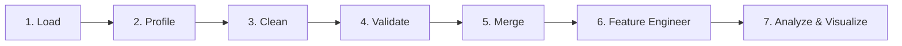

# CreatorPulse Analysis Methodology Notes

This document provides architectural, methodological, and analytical notes on the CreatorPulse data processing and intelligence pipeline.

---

## 1. Data Pipeline Stages

The CreatorPulse data pipeline is organized into seven sequential stages, ensuring clean data separation, idempotency, and auditability:

1. **Stage 1: Ingestion & Load (`src/data_loader.py`)**
   - Ingests raw CSV source tables (`creators.csv`, `campaigns.csv`, `customers.csv`, `purchases.csv`).
   - Applies strict string typing to key identifiers (`creator_id`, `campaign_id`, `customer_id`, `order_id`) to prevent loss of leading zeros or corrupted alphanumeric keys.
   - Utilizes caching (`@st.cache_data`) in the Streamlit application for low-latency re-renders.

2. **Stage 2: Profiling (`src/validation.py`)**
   - Profiles raw dataframes: total row counts, column types, null frequency, distinct counts, duplicate counts, and baseline descriptive statistics (`profile_dataset`).
   - Establishes baseline data health before transformations.

3. **Stage 3: Cleaning & Standardization (`src/cleaning.py`)**
   - Strips whitespace and normalizes text casing (e.g., creator names to Title Case, categories to capitalized strings).
   - Cleans currency formatting (removes currency symbols `₹`, commas, and trims whitespace) and parses numeric values safely.
   - Normalizes datetime columns using `pd.to_datetime(..., errors='coerce')`.
   - Flags anomalies such as negative follower counts (clamped to 0) and refunds (`is_refund = order_value < 0`).
   - Detects and eliminates redundant duplicate records.

4. **Stage 4: Validation & Quality Control (`src/validation.py`)**
   - Validates relational schemas and column contracts.
   - Enforces referential integrity across primary/foreign keys (e.g., `campaigns.creator_id` $\to$ `creators.creator_id`, `purchases.customer_id` $\to$ `customers.customer_id`).
   - Checks business logic constraints (e.g., `referral_clicks <= impressions`, engagement components non-negative, valid date bounds).

5. **Stage 5: Relational Merge (`src/features.py`)**
   - Constructs unified analytical datasets by joining transaction logs (`purchases`) with campaign dimensions (`campaigns`) and creator profiles (`creators`).
   - Retains left joins where appropriate to avoid silent omission of orphaned rows.

6. **Stage 6: Feature Engineering (`src/features.py`)**
   - Computes derived ratios: CTR, Conversion Rate, Engagement Rate, AOV, CAC.
   - Constructs behavioral categorizations: follower tiers, customer lifecycle segments, and cohort timestamps.

7. **Stage 7: Analysis & Insights (`src/analytics.py`, `src/insights.py`)**
   - Computes dimensional aggregations (by creator, campaign, tier, content type, platform).
   - Evaluates multi-stage conversion funnels, monthly time-series trends, and customer cohort retention matrices.
   - Applies deterministic rule-based engines to identify top performers, underperforming campaigns, and quadrant patterns.

---

## 2. Feature Engineering Rationale for Derived Metrics

| Metric | Rationale & Mathematical Form |
|---|---|
| **Engagement Rate** | Evaluates content resonance independently of reach: `(likes + comments + shares + saves) / impressions * 100`. Atomic summation prevents reliance on potentially desynchronized pre-computed aggregate columns. |
| **CTR (Click-Through Rate)** | Evaluates content call-to-action effectiveness: `referral_clicks / impressions * 100`. Isolates intent to transition from social platform to commerce store. |
| **Conversion Rate** | Evaluates downstream shopper intent: `purchases / referral_clicks * 100`. Grounded on referral clicks as the appropriate denominator representing actual storefront traffic. |
| **Creator Tier** | Categorizes scale into 5 standard tiers (`Nano <10K`, `Micro 10K-100K`, `Mid-Tier 100K-500K`, `Macro 500K-1M`, `Mega >1M`) to evaluate non-linear economies of scale and engagement decay. |
| **Customer Segments** | Classifies customer longevity and value into mutually exclusive classes (`One-time`, `Repeat`, `High-value`). Identifies core customer retention versus one-off acquisition churn. |
| **Repeat Purchase Rate** | Measures proportion of unique purchasers who return: `repeat_customers / unique_customers * 100`. Fundamental barometer of post-campaign product satisfaction. |
| **30-Day Repeat Rate** | Tracks velocity of repeat behavior by capturing secondary purchases within a 30-day window from initial acquisition. Provides an early indicator of long-term retention. |
| **Observed CLV** | Cumulative historical monetary contribution per customer entity. Distinguishes high-value cohorts without making unvalidated predictive statistical extrapolations. |
| **Customer Acquisition Cost (CAC)** | `campaign_budget / new_customers`. Quantifies capital efficiency of marketing spend per net-new customer onboarded. |
| **Average Order Value (AOV)** | `total_revenue / total_orders`. Evaluates price realization and cross-selling efficiency across different creator audiences. |

---

## 3. Insight Generation Approach

CreatorPulse intentionally utilizes a **deterministic, rule-based reasoning engine** rather than generative AI or black-box machine learning models for its automated recommendations:

- **No Hallucinations**: Business conclusions are strictly grounded in verifiable mathematical conditions and threshold evaluations.
- **Explainability & Transparency**: Every generated insight can be traced directly to an underlying formula, comparison threshold, or percentile benchmark.
- **Quadrant Pattern Classification**:
  - Creators are mapped into an Engagement vs. Conversion matrix using median benchmarks:
    - *High Engagement / High Conversion*: Prime brand ambassadors (scale budget).
    - *High Engagement / Low Conversion*: High resonance, weak commercial alignment (optimize offer/landing page).
    - *Low Engagement / High Conversion*: Niche/targeted appeal with high commercial intent (expand reach).
    - *Low Engagement / Low Conversion*: Underperforming partnerships (renegotiate or phase out).
- **Automated Anomaly & Boundary Detection**:
  - Highlights campaigns exceeding budget efficiency benchmarks ($CAC < \text{target}$) or suffering severe drop-offs ($CTR < 1\%$ or $Conversion < 0.5\%$).
  - Identifies refund spikes and discrepancies between platform reach and storefront traffic.

---

## 4. SQL Analysis Purpose and Approach

In addition to Python/pandas analytical routines, the system includes modular SQL scripts in the `sql/` directory (`campaign_metrics.sql`, `creator_metrics.sql`, `customer_metrics.sql`, `funnel_metrics.sql`):

- **Data Warehouse Parity**: Enables analytical workflows to run directly inside relational data warehouses or embedded engines (e.g., SQLite, DuckDB, Snowflake, BigQuery) without relying on Python runtimes.
- **Cross-Verification**: Serves as a dual-run audit mechanism where metrics calculated via pandas vectorized operations are verified against declarative SQL aggregate queries.
- **Portability**: Facilitates seamless handoffs to Business Intelligence (BI) tools such as Metabase, Tableau, or PowerBI.

---

## 5. Analytical Limitations (8+ Documented Constraints)

1. **Observational Confounding (Lack of Causality)**: Analyses are purely observational. Without randomized holdout groups (A/B testing), we cannot determine whether creator campaigns drove incremental sales or simply captured demand from users who were already going to purchase.
2. **First-Click / Single-Touch Attribution Bias**: Attribution relies on single-touch referral identifiers (`referring_creator_id`, `referring_campaign_id`). This ignores multi-touch customer journeys where multiple creators or paid channels touched the customer prior to purchase.
3. **Right-Censoring in Cohort Analysis**: Recent customer cohorts have had fewer days of exposure to make repeat purchases, inherently depressing their apparent repeat rates relative to mature cohorts.
4. **Cross-Device & Cookie Fragmentation**: Customers who click a creator link on a mobile social app but later finalize checkout on a desktop browser without affiliate parameters cannot be linked, undercounting creator conversion efficiency.
5. **Gross vs. Net Revenue Lag**: Refunds may settle days or weeks after the original transaction. Attributing refunds strictly to the initial campaign purchase date can create retroactive revenue revisions.
6. **Denominator Sensitivity**: Missing tracking links or bot-filtered referral clicks distort the conversion rate denominator.
7. **Omission of Overhead and Non-Monetary Costs**: CAC formulas reflect recorded media budget only, excluding product gifting costs, creator sampling, shipping overhead, agency retainers, and legal/management expenses.
8. **Synthetic / Simulated Data Boundaries**: The dataset contains synthetic distributions and generated edge cases (e.g., zero clicks, negative refund offsets) designed for stress-testing and demonstration, not real commercial findings.
9. **Platform-Specific Metric Incompatibilities**: Aggregating raw impression counts across diverse platforms (e.g., YouTube video views vs. Instagram feed impressions vs. Twitter impressions) conflates varying definitions of user attention and view duration.

---

## 6. Recommendations for Future Work

- **Multi-Touch & Shapley Value Attribution**: Implement fractional attribution models that distribute conversion credit across all marketing touchpoints within a 30-day lookback window.
- **Geo-Lift & Incrementality Testing**: Design structured regional holdout experiments to measure true incremental revenue lift against organic baseline sales.
- **Predictive Customer Lifetime Value (BG/NBD & Gamma-Gamma)**: Integrate probabilistic repeat-buyer models to forecast 12-month expected customer value based on early transaction frequency and recency.
- **Automated Anomaly Detection with Dynamic Thresholds**: Replace static median cuts with rolling z-score or IQR anomaly detection to identify significant day-over-day engagement spikes or drops.
- **Real-Time Webhook Ingestion**: Transition from static CSV batch loading to an event-driven streaming ingestion pipeline (e.g., Shopify/Stripe webhooks + social API webhooks).
- **Creator Cost-Per-Engagement (CPE) Benchmarking**: Ingest historical category rate cards to dynamically benchmark creator asking rates against achieved downstream conversion efficiency.
